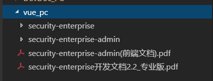

### 框架使用说明

<strong>【重要】</strong>此文档中示例框架的svn地址：[右键复制地址](http://192.168.0.55:10001/svn/MECProduct/Code/js/vue_pc)。**用于新项目请复制一份，不要在此示例框架中修改！** 如果你是第一次用此框架和java环境，请点击下载：[java框架所需文件.zip](ftp://192.168.0.28/%C7%B0%B6%CB%BF%AA%B7%A2%CE%C4%B5%B5/PC%B6%CB/%D7%CA%D4%B4/java%BF%F2%BC%DC%CB%F9%D0%E8%CE%C4%BC%FE.zip)，并按照以下顺序进行设置。

1. 此压缩包内包含：jdk(12)，IDEA，MAVEN(3.6.1)，若官网有新版本可从官网下载
2. 安装JDK并配置JDK环境：[WIN10配置JDK教程](https://jingyan.baidu.com/article/db55b609fa946e4ba20a2f56.html)
3. 安装IDEA，<em>jdk-12.0.1_windows-x64_bin.exe</em>是汉化文件，拷贝到IDEA安装目录/lib下
4. 激活并配置JDK：[IDEA配置JDK教程](https://jingyan.baidu.com/article/bea41d43a3b5edb4c51be6b6.html)
5. IDEA配置Maven：[IDEA配置Maven教程](https://www.cnblogs.com/sigm/p/6035155.html)
6. <em>LocalWarehouse.zip</em>是第5条教程中所用到的LocalWarehouse文件资源，后续就不需要再下载了。

 

    
+ <em>security-enterprise</em>：后端代码文件，具体操作请阅读[security-enterprise开发文档2.2_专业版.pdf]
+ <em>security-enterprise-admin</em>：前端代码文件，具体目录和文件说明请查看 [[框架资源说明]](ziyuanshuoming.md)，并按照规定操作。