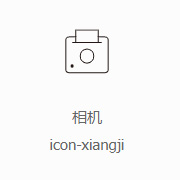
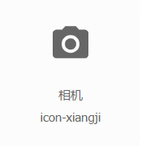

### 阿里图标库说明

<p>为了统一、规范公司图标样式和代码格式，后续所有项目都将采用阿里icon图标库，文件存于各项目的<em>fonts文件夹</em>中，更新图标库只需下载图库文件，覆盖此文件夹所有文件即可。</p>

<p><strong>【重要】</strong>目前公司图标库已分类，请不同项目开发人员按下面说明进行引用。</p>
<p><strong>【强制】</strong>一个项目只能引用一个图标库。</p>
<p><strong>【强制】</strong>所有图标前缀必须为<code>icon</code></p>

* <em>PC端-GIS产品图标库</em>：仅用于公司GIS产品的图库，不得用于任何项目！！！
* <em>PC端-项目-线形图标库</em>：用于公司所有项目，风格为扁平化的先行图标，效果如图1。
* <em>PC端-项目-面形图标库</em>：用于公司所有项目，风格为带有底色的面型图标，效果如图2。

<div class="flexcenter">
    
    
</div>

### 使用方法

图标库地址：[阿里icon](https://www.iconfont.cn)
<p>用户名：sdjcwx</p>
<p>密码：***</p>

```html
// 引用一个图标:
<i class="icon icon-xiangji></i>
```